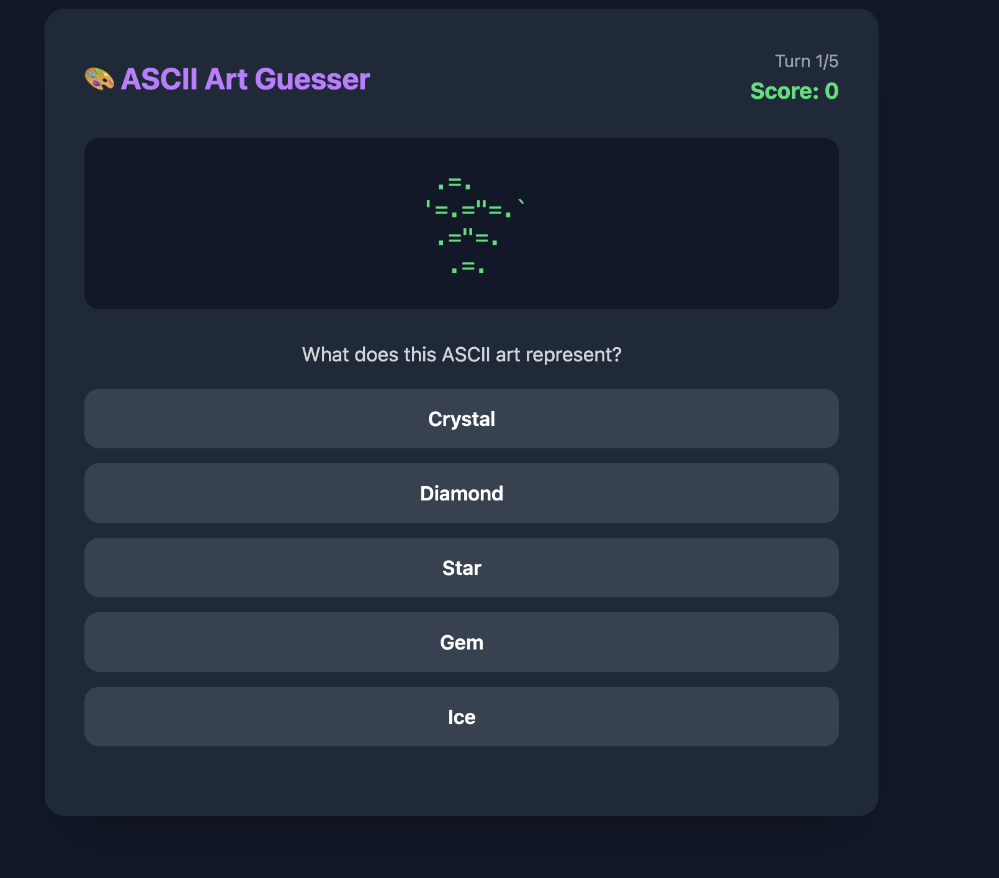

# 🎨 ASCII Art Guesser

A fun turn-based guessing game where players identify what ASCII art pictures represent. Built with React, Vite, and Tailwind CSS.


## 🎮 How to Play

1. Select the number of rounds (3-15) using the slider
2. Click "Start Game"
3. Look at the ASCII art displayed
4. Choose the correct answer from 5 options
5. Get instant feedback on your guess
6. Continue until all rounds are complete
7. See your final score and play again!

## 🚀 Getting Started

### Prerequisites

- Node.js (v18 or higher recommended)
- npm

### Installation

```bash
cd my-react-app
npm install
```

### Running the Game

```bash
npm run dev
```

Open [http://localhost:5173](http://localhost:5173) in your browser.

### Building for Production

```bash
npm run build
npm run preview
```

## 🛠️ Tech Stack

- **React 19** - UI framework
- **Vite 7** - Build tool and dev server
- **Tailwind CSS 4** - Styling

## 📁 Project Structure

```
my-react-app/
├── src/
│   ├── App.jsx              # Main game component with state machine
│   ├── index.css            # Tailwind imports
│   ├── main.jsx             # React entry point
│   └── data/
│       └── gameConfig.json  # ASCII art puzzles configuration
├── index.html
├── vite.config.js
└── package.json
```

## 🎯 Game States

The game uses a simple state machine with three states:

1. **STARTING** - Configure game options (number of rounds)
2. **PLAYING** - Active gameplay with random puzzle selection
3. **DONE** - Display final score and restart option

## 📝 Adding New Puzzles

Edit `src/data/gameConfig.json` to add new ASCII art puzzles:

```json
{
  "ascii_art_string": "  /\\_/\\  \n ( o.o ) \n  > ^ <",
  "height_chars": 3,
  "width_chars": 9,
  "solution": "Cat",
  "options": ["Dog", "Cat", "Rabbit", "Fox", "Mouse"]
}
```

- `ascii_art_string` - The ASCII art (use `\n` for newlines)
- `height_chars` - Height in characters
- `width_chars` - Width in characters
- `solution` - The correct answer
- `options` - Array of 5 choices (must include the solution)

## 📜 License

MIT
